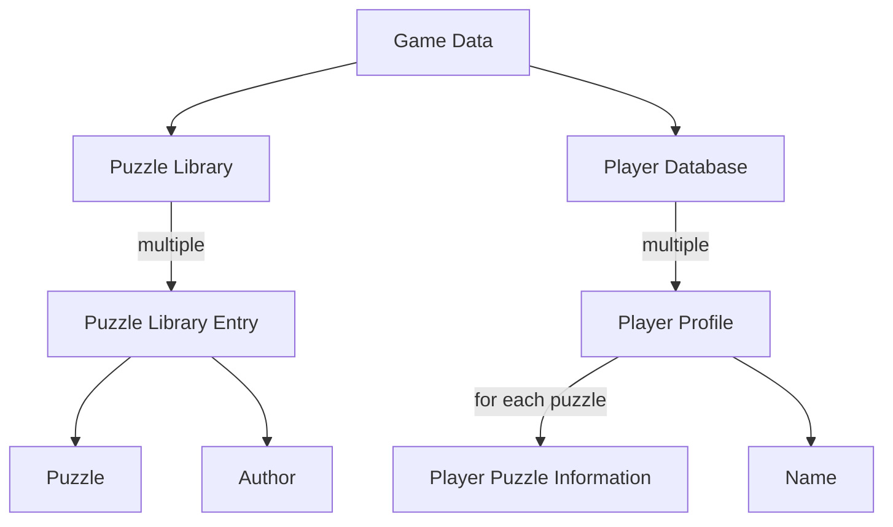
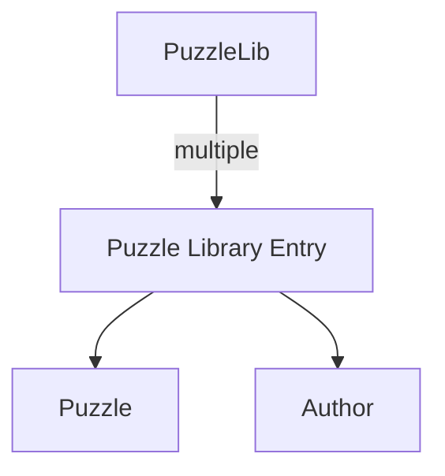
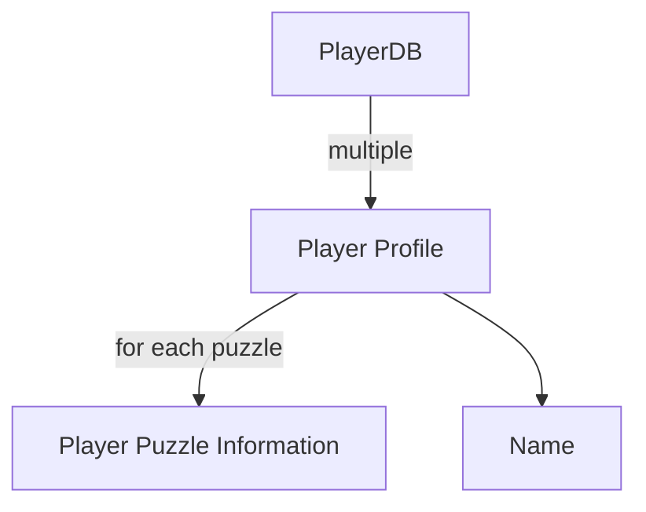

# Design

This text contains diagrams written in Mermaid script. GitHub does not support
this format, but Visual Studio Code does have an extension
"Markdown Preview Mermaid Support."

## PiCrossFacade

The `PiCrossFacade` class is the entry point to the PiCross domain.

```C#
public class PiCrossFacade
{
    public IGameData CreateEmptyGameData();

    public IGameData CreateDummyGameData();

    public IGameData LoadGameData( string path, bool createIfNotExistent = false );

    public IPuzzleEditor CreatePuzzleEditor( Puzzle puzzle );

    public IStepwisePuzzleSolver CreateStepwisePuzzleSolver(
        ISequence<Constraints> rowConstraints,
        ISequence<Constraints> columnConstraints );

    public IPlayablePuzzle CreatePlayablePuzzle( Puzzle puzzle );
}
```

The three first methods (`CreateEmptyGameData()`, `CreateDummyGameData()` and
`LoadGameData()`) allow you to get access to a `IGameData` object.
This object contains all data related to players and puzzles. See below for more information.

`CreateDummyGameData()` is probably the most practical for development/debugging purposes.
However, for a fully functional project, you will need to switch to `LoadGameData`.

`CreatePuzzleEditor` allows you to create a `IPuzzleEditor` object, which
assists you in creating a puzzle editor. You will only need this method
if you wish to implement puzzle editing functionality.

You will probably not need `CreateStepwisePuzzleSolver`.

`CreatePlayablePuzzle` will be indispensible for creating the actual game.
It returns an `IPlayablePuzzle` object which features
all functionality to let players solve a puzzle.

## `IGameData`

All PiCross-related data is stored in an `IGameData` object.
It has the following structure:



The Game Data has two components:

* The Puzzle Library: contains all data concerning puzzles
* The Player Database: stores all player-related information

## Puzzle Library



In code:

```C#
public interface IPuzzleLibrary
{
    IEnumerable<IPuzzleLibraryEntry> Entries { get; }

    IPuzzleLibraryEntry Create( Puzzle puzzle, string author );
}

public interface IPuzzleLibraryEntry
{
    Puzzle Puzzle { get; set; }

    string Author { get; set; }
}
```

As you can see, an `IPuzzleLibrary` object contains
a list of `Entries` of type `IPuzzleLibraryEntry`.
An entry consists of a `Puzzle` object and an `Author`.

## Player Database



In code:

```C#
public interface IPlayerLibrary
{
    IPlayerProfile this[string name] { get; }

    IPlayerProfile CreateNewProfile( string name );

    bool IsValidPlayerName( string name );

    IList<string> PlayerNames { get; }
}

public interface IPlayerProfile
{
    IPlayerPuzzleInformation this[IPuzzleLibraryEntry libraryEntry] { get; }

    string Name { get; }
}
```

To get a list of all player names, use the `PlayerNames` property.
Once you got hold of a player name, you can use the indexer
to get the player's profile:

```C#
var facade = new PiCrossFacade();
var playerName = facade.PlayerDatabase.PlayerNames[0]; // Get first player's name
var playerProfile = facade.PlayerDatabase[playerName];
```

The `IPlayerProfile` tracks the player's progress. For each puzzle,
you can query the `IPlayerPuzzleInformation`:

```C#
var puzzleEntry = facade.PuzzleLibrary.Entries.First(); // Get first puzzle from library

```